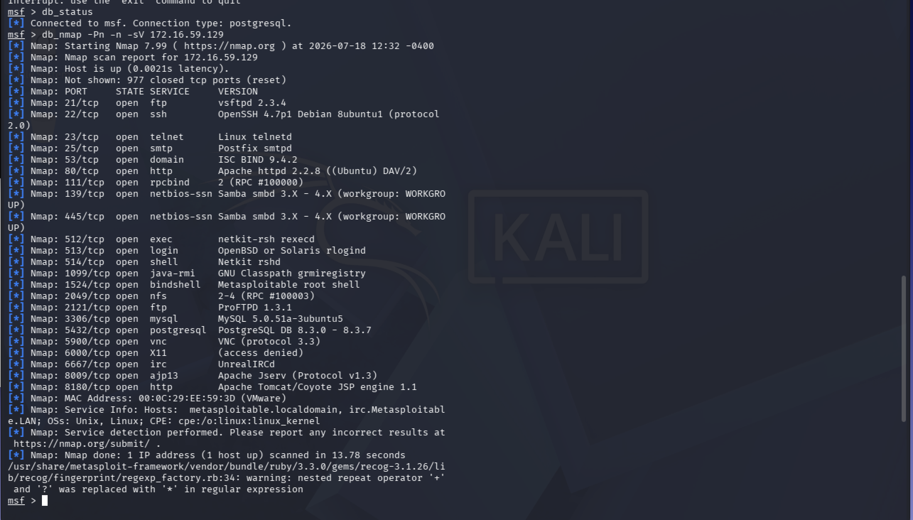

# Network Scanning with Nmap

## Objective

Discover hosts and services on a target network.

## Lab Environment

Attacker:
- Kali Linux

Target:
- Metasploitable2

## Tools

- Nmap

## Commands

nmap -sV target-ip

nmap -A target-ip

nmap -O target-ip

## Findings
Findings
Finding 1: Multiple Network Services Exposed

Severity: High

Description

The scan identified 23 open TCP ports, indicating that numerous services are accessible over the network. Each exposed service represents a potential entry point that should be reviewed and secured.

Evidence

The following ports were identified as open:

Port	Service
21	FTP
22	SSH
23	Telnet
25	SMTP
53	DNS
80	HTTP
111	RPCBind
139	NetBIOS
445	SMB
512	rexecd
513	rlogin
514	rsh
1099	Java RMI
1524	Bind Shell
2049	NFS
2121	FTP
3306	MySQL
5432	PostgreSQL
5900	VNC
6000	X11
6667	IRC
8009	AJP13
8180	HTTP (Tomcat)
Impact

A large attack surface increases the likelihood of exploitation if services are misconfigured, outdated, or unnecessarily exposed.

Recommendation
Disable unnecessary services.
Restrict network exposure through firewalls.
Apply the principle of least functionality.
Finding 2: Legacy FTP Service Detected

Severity: High

Description

The target is running vsftpd 2.3.4 on TCP port 21.

Evidence
21/tcp open ftp vsftpd 2.3.4
Impact

Older FTP implementations may have known security issues and FTP itself transmits credentials and data without encryption.

Recommendation
Replace FTP with SFTP or FTPS where possible.
Ensure software is updated and configured securely.
Finding 3: Telnet Service Enabled

Severity: High

Description

The Telnet service is enabled on TCP port 23.

Evidence
23/tcp open telnet Linux telnetd
Impact

Telnet transmits credentials in plaintext, making it vulnerable to interception on untrusted networks.

Recommendation
Disable Telnet.
Use SSH for remote administration.
Finding 4: Outdated Web Server

Severity: Medium

Description

Apache HTTP Server version 2.2.8 is running on TCP port 80.

Evidence
80/tcp open http Apache httpd 2.2.8
Impact

Older web server versions may contain vulnerabilities that have been addressed in later releases.

Recommendation
Upgrade to a supported version.
Perform regular web application and server security assessments.
Finding 5: SMB File Sharing Exposed

Severity: High

Description

SMB services are accessible on ports 139 and 445.

Evidence
139/tcp open netbios-ssn Samba smbd
445/tcp open netbios-ssn Samba smbd
Impact

Exposed SMB services can increase the risk of unauthorized access or exploitation if not properly secured.

Recommendation
Restrict SMB access to trusted hosts.
Use supported SMB versions.
Review share permissions regularly.
Finding 6: Legacy Remote Administration Services

Severity: High

Description

Legacy remote administration protocols were detected.

Evidence
512/tcp exec
513/tcp login
514/tcp shell
Impact

These protocols do not provide modern security protections and should not be used in production environments.

Recommendation
Disable RSH, Rlogin, and Rexec.
Standardize on SSH for remote administration.
Finding 7: Database Services Exposed

Severity: High

Description

Both MySQL and PostgreSQL services are exposed.

Evidence
3306/tcp MySQL 5.0.51a
5432/tcp PostgreSQL 8.x
Impact

Database services should not generally be directly accessible from untrusted networks. Exposure increases the importance of strong authentication, access controls, and patch management.

Recommendation
Restrict access using firewalls.
Limit database access to authorized application servers and administrators.
Maintain supported software versions.
Finding 8: Multiple FTP Services

Severity: Medium

Description

Two FTP services are running on different ports.

Evidence
21/tcp vsftpd
2121/tcp ProFTPD
Impact

Running multiple services that provide similar functionality increases the attack surface and operational complexity.

Recommendation
Remove redundant services where possible.
Ensure each service has a documented business purpose.
Finding 9: Remote Desktop Service Exposed

Severity: Medium

Description

VNC is accessible on TCP port 5900.

Evidence
5900/tcp open vnc
Impact

Remote desktop services should be carefully protected because they provide interactive access to systems.

Recommendation
Restrict access using network controls.
Enforce strong authentication.
Use encrypted tunnels or VPNs where appropriate.
Finding 10: Apache Tomcat Service Identified

Severity: Medium

Description

Apache Tomcat was identified on TCP port 8180.

Evidence
8180/tcp open http Apache Tomcat
Impact

Application servers may expose administrative interfaces or sample applications if not securely configured.

Recommendation
Remove default applications.
Secure administrative interfaces.
Review deployment and authentication settings.
Finding 11: Host Operating System Identified

Severity: Informational

Description

The target was identified as a Linux system.

Evidence
OS: Linux
Impact

Operating system identification helps defenders maintain asset inventories and assists authorized security assessments.

Recommendation
Keep operating systems up to date.
Maintain an accurate inventory of assets and their software versions.
Finding 12: Service Version Disclosure

Severity: Medium

Description

The scan successfully identified detailed version information for multiple services.

Evidence

Examples include:

vsftpd 2.3.4
OpenSSH 4.7p1
Apache 2.2.8
MySQL 5.0.51a
PostgreSQL 8.3.x
Impact

Service version disclosure can assist an attacker in identifying publicly documented vulnerabilities associated with those software versions.

Recommendation
Limit unnecessary version disclosure where feasible.
Maintain regular patching and vulnerability management processes.
Overall Assessment

The nmap_metasploit_scan_sv results reveal a broad attack surface characterized by numerous exposed services, several legacy protocols, and multiple older software versions. This is expected for the intentionally vulnerable Metasploitable 2 training environment. In a production environment, these findings would warrant prompt review, with emphasis on reducing exposed services, replacing insecure protocols, maintaining supported software versions, and implementing appropriate network segmentation and access controls.
...

## Mitigation

Mitigations
1. Reduce the Attack Surface
Issue

The scan identified 23 open TCP ports, exposing numerous services to the network.

Mitigation
Disable or uninstall services that are not required for business operations.
Close unused ports using host-based or network firewalls.
Apply the Principle of Least Functionality, ensuring that only essential services are enabled.
Perform periodic service reviews and remove obsolete applications.
2. Secure or Replace FTP Services
Issue

The host exposes FTP services (vsftpd and ProFTPD).

Mitigation
Replace FTP with SFTP (SSH File Transfer Protocol) or FTPS to encrypt data in transit.
Disable anonymous FTP access unless there is a documented business requirement.
Enforce strong authentication and monitor file transfer activity.
Keep FTP software updated with vendor-supported versions.
3. Disable Telnet
Issue

The Telnet service is enabled and transmits credentials in plaintext.

Mitigation
Disable the Telnet service.
Use SSH for remote administration.
Restrict SSH access to authorized users and trusted networks.
Implement key-based authentication where appropriate.
4. Upgrade Outdated Software
Issue

Several services appear to be running older software versions.

Mitigation
Implement a structured patch management process.
Upgrade software to supported versions.
Subscribe to vendor security advisories.
Regularly perform vulnerability scans to identify outdated software.
5. Secure SMB Services
Issue

SMB services are exposed on ports 139 and 445.

Mitigation
Restrict SMB access using firewall rules.
Disable SMBv1 if present and use newer, supported SMB versions.
Limit shared folders to authorized users.
Enable auditing and logging of SMB activity.
Apply security updates for the SMB service.
6. Remove Legacy Remote Administration Services
Issue

Legacy services such as rexec, rlogin, and rsh are enabled.

Mitigation
Disable all legacy remote administration protocols.
Standardize on SSH for remote access.
Restrict administrative access through access control lists (ACLs) or VPNs.
Regularly review remote administration services for necessity.
7. Protect Database Services
Issue

MySQL and PostgreSQL services are accessible over the network.

Mitigation
Restrict database access to trusted hosts or application servers.
Implement strong authentication and least-privilege database accounts.
Encrypt network traffic using TLS where supported.
Disable remote access if local access is sufficient.
Keep database software patched and supported.
8. Secure Remote Desktop Services
Issue

The VNC service is exposed.

Mitigation
Restrict VNC access using firewalls or VPNs.
Require strong authentication and, where supported, encryption.
Disable the service when it is not required.
Monitor remote access logs for unauthorized activity.
9. Harden Web Servers
Issue

Apache HTTP Server and Apache Tomcat are exposed.

Mitigation
Upgrade to supported software versions.
Remove default pages, sample applications, and unnecessary modules.
Disable server version banners where feasible.
Apply secure HTTP response headers.
Conduct regular web application security testing.
10. Secure RPC and NFS Services
Issue

RPC and NFS services are accessible.

Mitigation
Restrict access to trusted internal networks.
Configure NFS exports using the principle of least privilege.
Disable unused RPC services.
Regularly review file-sharing permissions.
11. Restrict Service Version Disclosure
Issue

Service version information is exposed during scanning.

Mitigation
Configure services to minimize version and banner disclosure where practical.
Use reverse proxies or hardened configurations to limit unnecessary information exposure.
Recognize that banner suppression complements—but does not replace—timely patching and secure configuration.
12. Implement Network Segmentation
Issue

Numerous services are directly reachable.

Mitigation
Separate critical systems into dedicated network segments.
Use firewalls to restrict communication between segments.
Expose only services that are required for business operations.
Apply a default-deny approach to inbound network traffic.
13. Strengthen Monitoring and Logging
Issue

Multiple exposed services increase the likelihood of security events.

Mitigation
Centralize system and application logs using a SIEM solution.
Monitor authentication attempts, service activity, and network connections.
Configure alerts for unusual or unauthorized behavior.
Regularly review logs as part of incident detection and response.
14. Conduct Regular Security Assessments
Issue

Routine security validation is essential to maintain a strong security posture.

Mitigation
Schedule regular vulnerability assessments and penetration tests.
Validate remediation efforts through follow-up scans.
Maintain an accurate inventory of systems and services.
Review configurations against recognized security benchmarks (such as CIS Benchmarks where applicable).
Overall Remediation Strategy

The assessment identified a broad attack surface, legacy services, and several outdated software versions. Although these characteristics are expected in the intentionally vulnerable Metasploitable 2 environment, a comparable production system should prioritize the following actions:

Remove unnecessary services and close unused ports.
Replace insecure legacy protocols (such as Telnet, RSH, and FTP) with secure alternatives.
Upgrade unsupported or outdated software.
Restrict administrative and database services to trusted networks.
Implement network segmentation and least-privilege access controls.
Establish continuous vulnerability management, monitoring, and patch management processes.

These mitigations follow established defensive practices and provide a clear roadmap for reducing the attack surface while improving the overall security posture of a production environment.
...

## Lessons Learned

...
